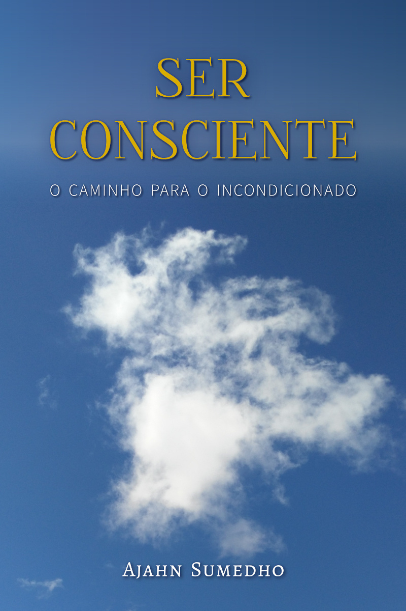

= Ser Consciente 
:booktitle: {doctitle}
:description: Transcendendo a vida e a morte - Ensinamentos sobre meditação
:author: Ajahn Sumedho
:creator: {author}
:version: v1.0
:revdate: 2017-10-14
:doctype: book
:lang: pt
:pubs-logo: sumedharama-w100.jpg
:publisher-name: Publicações Sumedhārāma
:publisher-website: www.sumedharama.pt
:source: https://forestsangha.org
:keywords: Ajahn Sumedho, Dhamma, meditation, Buddhism, RELIGION / Buddhism / Theravada
:copyright: CC-BY-NC-ND 4.0
:isbn: 000-0-00000-000-0
:identifier: isbn:{isbn}
:imagesdir: assets/photos/92dpi-ebook-sRGB
:includes: manuscript/asciidoc
:front-cover-image: 
:toc: left
:toc-title: Índice
:toclevels: 0

include::{includes}/titlepage.adoc[]

include::{includes}/introduction.adoc[]

include::{includes}/preface.adoc[]

include::{includes}/01-investigacao.adoc[]

include::{includes}/02-instrucao.adoc[]

include::{includes}/03-reflexao.adoc[]

include::{includes}/copyright.adoc[]

